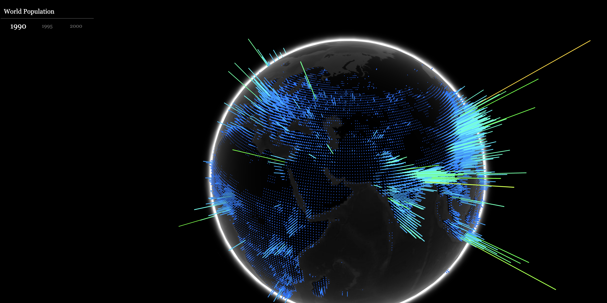

doc    
https://sbcode.net/threejs/socketio-branch/

- https://github.com/keaukraine/webgl-rock-pillars.git  WEBGL only

- https://nextgtrgod.github.io/threejs-floating-island/

- https://github.com/karan36k/island3d

- https://github.com/DHBW-FN-TIT20/Lost-Island

- https://github.com/dataarts/webgl-globe

- Lots of exemples https://github.com/gkjohnson/threejs-sandbox
- https://github.com/ykob/sketch-threejs
     - https://ykob.github.io/sketch-threejs/
     - https://ykob.github.io/sketch-threejs/sketch/flow_field_4.html

- https://github.com/blaze33/droneWorld
  

- https://github.com/Priler/dino3d
- https://priler.github.io/dino3d/

- https://github.com/3mapslab/3DigitalTwin

- https://github.com/danielesteban/softxels
  

- https://pmndrs.github.io/cannon-es/examples/

- https://github.com/NikLever/threejs-games-course/

- https://github.com/NikLever/Pipedown
  

APP:
- https://homeidea3d.seanwasere.com/

 - SOCKER.IO
     - https://github.com/Sean-Bradley/First-Car-Shooter
       

     - https://github.com/1hella/nodejs-3d-tic-tac-toe.git
       

     - https://github.com/owenashurst/agar.io-clone
     - https://github.com/VVhispo/Battleship-3D-in-Three.js
       

     - https://github.com/bondarevk/socketgame-3d
     - https://github.com/blaze33/map33.js
     - https://map33.openbloc.com/
       

     - https://github.com/MswTester/sobylon
       

  
DATA:  
- https://github.com/vasturiano/3d-force-graph
  

